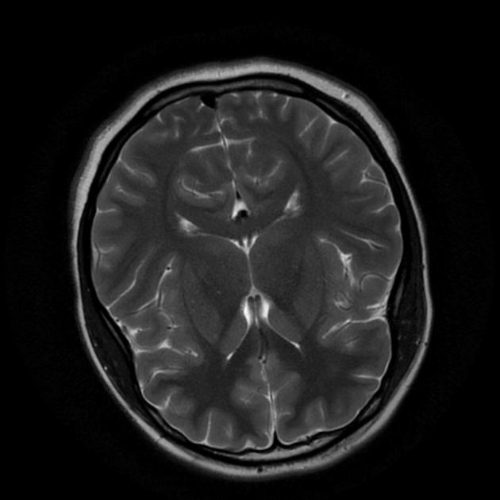
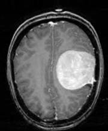

# 🧠✨ **Brain Tumor Detection System** 

Welcome to the **Brain Tumor Detection System**! This project combines image processing and deep learning to detect brain tumors in MRI scans. It offers an intuitive graphical user interface (GUI) where users can upload MRI images, view tumor detection results, and explore the tumor regions. 🧑‍⚕️💡


## 🌟 **Key Features**

- **🧠 Tumor Detection**: Detects whether a tumor is present in the MRI scan using an advanced neural network model 🤖.
- **🔬 View Tumor Region**: Visualizes the tumor regions on MRI scans 🔍🧠.
- **🧹 Noise Removal**: Cleans the MRI image for better accuracy in tumor detection 🧼✨.
- **🎨 Simple & Stylish GUI**: Interact easily with the system through a sleek interface made with Tkinter 🖥️.


## ⚙️ **Requirements**

Ensure you have the following installed to run the system:

- 🔑 Python 3.x
- 🖼️ Tkinter (for GUI)
- 🧳 OpenCV (`opencv-python`)
- 🧮 NumPy (`numpy`)
- 🧠 TensorFlow (`tensorflow`)
- 🖼️ Pillow (`Pillow`)
- 🛠️ imutils (`imutils`)


## 🚀 **How to Use**

1. **Clone the Repository**:
    ```bash
    git clone https://github.com/vibey19/Brain-Tumor-Detection-System
    cd Brain-Tumor-Detection-System
    ```

2. **Install Dependencies**:
    ```bash
    pip install -r requirements.txt
    ```

3. **Run the Application**:
    ```bash
    python gui.py
    ```

4. **Upload an MRI Image** and choose one of the following options:
    - **🧠 Detect Tumor**: Identify if there’s a tumor in the MRI image.
    - **🔍 View Tumor Region**: See the highlighted tumor regions in the image.


## 📸 **Screenshots**

Check out some screenshots of the system in action:

### 1. **No Tumor Detected** 🧠❌



### 2. **Tumor Detected** 🧠⚠️



### 3. **Tumor Detection Process** 🧬⚙️


### 4. **Tumor Region Visualization** 🧠✨


## 🧑‍🔬 **How It Works**

1. **📤 Image Upload**: Upload an MRI image through the GUI.
2. **⚙️ Preprocessing**: The image is converted to grayscale and cleaned up by removing noise.
3. **🔍 Tumor Detection**: The system uses a pre-trained deep learning model (`brain_tumor_detector.h5`) to predict tumor presence.
4. **🖼️ Visualization**: If a tumor is found, the region is highlighted and shown in the image.
